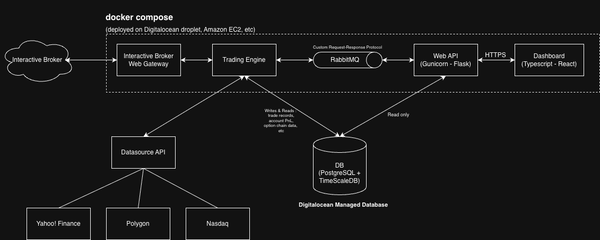
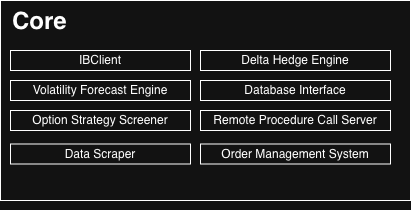
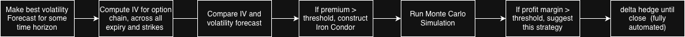

# Overview
Full-stack, multi-container options trading platform.  
Dockerized system with a modular Core service, RabbitMQ message bus, Flask-Gunicorn API, React-TypeScript dashboard, and PostgreSQL + TimescaleDB Database.

Finds and recommends SPY option spread trades using volatility risk premium (VRP) and Monte Carlo simulation.

## Architecture


This trading framework is fully dockerized and contains the following images:

### Core
Modular service that owns trading logic and broker connectivity. Main components:

- **IBClient** – Interactive Brokers TWS API connectivity
- **Volatility Forecast Engine** – HAR-X based forecasting
- **Option Strategy Screener** – VRP-based iron condor discovery + Monte Carlo
- **Delta Hedge Engine** – automated delta hedging
- **Order Management System**
- **Data Scraper** + **Database Interface**
- **RPC Server** – handles requests from the Web API via RabbitMQ

Uses dependency injection as the primary composition pattern.



### Web API

Make requests to the Core through RabbitMQ, and expose API to the frontend dashboard.

Tech stack: Gunicorn + Flask

### Interactive Broker Web Gateway

Required for Interactive Broker API. Automatically authenticate to achieve (almost) fully headless session.

Image: https://github.com/gnzsnz/ib-gateway-docker

### RabbitMQ 

Message broker for requests/response betweeen core and web api

### Database

Store option chain snapshot from data api and 5min bars. Also store trade records, performance, etc.

Tech stack: Postgresql + TimescaleDB extension

### Dashborad

Trading dashboard, trading performance and data visualisation, ordering UI, etc.

Tech stack: React + Typescript

## Design highlights
The system is deliberately split into independently deployable containers. Core owns all trading state and broker interaction. The Web API is a thin layer that communicates with Core exclusively through RabbitMQ (request/response). This keeps the dashboard responsive and isolates the trading engine. TimescaleDB is used for efficient storage of option chain snapshots and 5-minute bars.

## Tech Stack
- **Backend / Core**: Python, dependency injection, multithreading
- **Messaging**: RabbitMQ (request/response between Core and Web API)
- **API**: Flask + Gunicorn
- **Frontend**: React + TypeScript
- **Database**: PostgreSQL + TimescaleDB
- **Infrastructure**: Docker Compose, DigitalOcean
- **Data**: Yahoo Finance, Polygon, Nasdaq

## Trade Logic

The key metric is Volatility Risk Premium (VRP):
VRP = Implied Volatility (IV) - Realized Volatility(RV)

We construct and train a volatility forecasting model, (for detail, refer to https://github.com/cahs0505/volatility_forecasting_with_HAR-X_model) make our best volatility forecast, compute IV for SPY option chain, 
and find the options that are rich in VRP. If the resulting VRP passes our threshold, we construct an iron condor spread and run Monte Carlo simulation and find expected profit. We finally push this trade if EV passes our threshold. This is the overall logic:



## Usage

Create a `docker-compose.yaml`and `.env` and run `docker compose up`. 

Examples: 

`docker-compose.yaml` : 
```yaml
name: trade
services:
  ib-gateway:
    restart: always
    platform: linux/amd64
    build:
      context: ./stable
      tags:
        - "ghcr.io/gnzsnz/ib-gateway:stable"
    image: ghcr.io/gnzsnz/ib-gateway:stable
    env_file:
      - ibc.env
    environment:
      TWS_USERID: ${TWS_USERID}
      TWS_PASSWORD: ${TWS_PASSWORD}
      TWS_PASSWORD_FILE: ${TWS_PASSWORD_FILE:-}
      TRADING_MODE: ${TRADING_MODE:-paper}
      TWS_SETTINGS_PATH: ${TWS_SETTINGS_PATH:-}
      TWS_ACCEPT_INCOMING: ${TWS_ACCEPT_INCOMING:-}
      TWS_MASTER_CLIENT_ID: ${TWS_MASTER_CLIENT_ID:-}
      READ_ONLY_API: ${READ_ONLY_API:-}
      VNC_SERVER_PASSWORD: ${VNC_SERVER_PASSWORD:-}
      TWOFA_TIMEOUT_ACTION: ${TWOFA_TIMEOUT_ACTION:-exit}
      BYPASS_WARNING: ${BYPASS_WARNING:-}
      AUTO_RESTART_TIME: ${AUTO_RESTART_TIME:-}
      AUTO_LOGOFF_TIME: ${AUTO_LOGOFF_TIME:-}
      TWS_COLD_RESTART: ${TWS_COLD_RESTART:-}
      SAVE_TWS_SETTINGS: ${SAVE_TWS_SETTINGS:-}
      RELOGIN_AFTER_TWOFA_TIMEOUT: ${RELOGIN_AFTER_TWOFA_TIMEOUT:-no}
      TWOFA_EXIT_INTERVAL: ${TWOFA_EXIT_INTERVAL:-60}
      TWOFA_DEVICE: ${TWOFA_DEVICE:-}
      EXISTING_SESSION_DETECTED_ACTION: ${EXISTING_SESSION_DETECTED_ACTION:-primary}
      ALLOW_BLIND_TRADING: ${ALLOW_BLIND_TRADING:-no}
      TIME_ZONE: ${TIME_ZONE:-Etc/UTC}
      TZ: ${TIME_ZONE:-Etc/UTC}
      CUSTOM_CONFIG: ${CUSTOM_CONFIG:-NO}
      JAVA_HEAP_SIZE: ${JAVA_HEAP_SIZE:-}
      SSH_TUNNEL: ${SSH_TUNNEL:-}
      SSH_OPTIONS: ${SSH_OPTIONS:-}
      SSH_ALIVE_INTERVAL: ${SSH_ALIVE_INTERVAL:-}
      SSH_ALIVE_COUNT: ${SSH_ALIVE_COUNT:-}
      SSH_PASSPHRASE: ${SSH_PASSPHRASE:-}
      SSH_REMOTE_PORT: ${SSH_REMOTE_PORT:-}
      SSH_USER_TUNNEL: ${SSH_USER_TUNNEL:-}
      SSH_RESTART: ${SSH_RESTART:-}
      SSH_VNC_PORT: ${SSH_VNC_PORT:-}
      START_SCRIPTS: ${START_SCRIPTS:-}
      X_SCRIPTS: ${X_SCRIPTS:-}
      IBC_SCRIPTS: ${IBC_SCRIPTS:-}
    volumes:
     - ${PWD}/jts.ini:/home/ibgateway/Jts/jts.ini
     - ${PWD}/config.ini:/home/ibgateway/ibc/config.ini
#      - ${PWD}/tws_settings/:${TWS_SETTINGS_PATH:-/home/ibgateway/tws_settings}
#      - ${PWD}/ssh/:/home/ibgateway/.ssh
#      - ${PWD}/init-scripts:/home/ibgateway/init-scripts
    networks:
          - base-network
    ports:
      - "4001:4003"
      - "4002:4004"
      # - "5900:5900"
      - "7462:7462" # IBC command server

    healthcheck:
      test: (echo "RECONNECTDATA") | telnet "0.0.0.0" 7462
      interval: 60s
      timeout: 60s
      retries: 3
      start_period: 60s
      start_interval: 60s

  rabbitmq:
    image: rabbitmq:4-management
    container_name: rabbitmq
    ports:
      - 5672           # AMQP
      - "15672:15672"  # Management UI
    environment:
      RABBITMQ_DEFAULT_USER: guest
      RABBITMQ_DEFAULT_PASS: guest
    volumes:
      - rabbitmq_data:/var/lib/rabbitmq
    healthcheck:
      test: ["CMD", "rabbitmq-diagnostics", "-q", "ping"]
      interval: 10s
      timeout: 5s
      retries: 3
      start_period: 40s 
    networks:
      - base-network

  core:
    image: cahs0505/trade-core
    build:
      ./
    environment:
      DATABASE_NAME: ${DATABASE_NAME}
      DATABASE_USER: ${DATABASE_USER}
      DATABASE_PASSWORD: ${DATABASE_PASSWORD}
      DATABASE_HOST: ${DATABASE_HOST}
      DATABASE_PORT: ${DATABASE_PORT}

      IB_HOST: ib-gateway
      IB_PORT: 4004
    
      RABBITMQ_HOST : rabbitmq
      RABBITMQ_PORT : ${RABBITMQ_PORT}
      RABBITMQ_QUEUE : ${RABBITMQ_QUEUE}
      RABBITMQ_USER: guest
      RABBITMQ_PASS: guest
      RABBITMQ_VHOST: /

      DELTA_MARGIN: ${DELTA_MARGIN}
      HEDGE_FREQ: ${HEDGE_FREQ}
      IC_SHORT_STRIKE_DELTA_TARGET: ${IC_SHORT_STRIKE_DELTA_TARGET}
      IC_LONG_STRIKE_DELTA_TARGET: ${IC_LONG_STRIKE_DELTA_TARGET}
      VRP_THRESHOLD: ${VRP_THRESHOLD}
      RISK_FREE_INTEREST_RATE: ${RISK_FREE_INTEREST_RATE}
      SPY_ANNUAL_DIVIDEND_YIELD: ${SPY_ANNUAL_DIVIDEND_YIELD}
    networks:
      - base-network
    depends_on:
      rabbitmq:
        condition: service_healthy
      ib-gateway:
        condition: service_healthy

  flask:
    image: cahs0505/trade-flask
    build:
      ./
    environment:
      RABBITMQ_HOST : rabbitmq
      RABBITMQ_PORT : ${RABBITMQ_PORT}
      RABBITMQ_QUEUE : ${RABBITMQ_QUEUE}
      RABBITMQ_USER: admin
      RABBITMQ_PASS: supersecret
      RABBITMQ_VHOST: /

      DELTA_MARGIN: ${DELTA_MARGIN}
      HEDGE_FREQ: ${HEDGE_FREQ}
      IC_SHORT_STRIKE_DELTA_TARGET: ${IC_SHORT_STRIKE_DELTA_TARGET}
      IC_LONG_STRIKE_DELTA_TARGET: ${IC_LONG_STRIKE_DELTA_TARGET}
      VRP_THRESHOLD: ${VRP_THRESHOLD}
      RISK_FREE_INTEREST_RATE: ${RISK_FREE_INTEREST_RATE}
      SPY_ANNUAL_DIVIDEND_YIELD: ${SPY_ANNUAL_DIVIDEND_YIELD}

    ports:
      - 8000
    networks:
      - base-network
    depends_on:
      rabbitmq:
          condition: service_healthy
      ib-gateway:
        condition: service_healthy

networks:
  base-network:
    driver: bridge

volumes:
  rabbitmq_data:
```
`.env`:

```.env
####  REMOTE DB  ####
DATABASE_NAME = mydb
DATABASE_USER = admin
DATABASE_PASSWORD = 123456
DATABASE_HOST = db-postgresql-example.db.ondigitalocean.com
DATABASE_PORT = 25060

### API KEYS ###
MY_API_KEY = abc

### RABBITMQ ###
RABBITMQ_HOST = localhost
RABBITMQ_PORT = 5672
RABBITMQ_QUEUE = core-flask-queue
RABBITMQ_USER = user
RABBITMQ_PASS = pass
RABBITMQ_VHOST = /

### TWS ###
IB_HOST = localhost
IB_PORT = 4002
TWS_USERID_PAPER = myuserid
TWS_PASSWORD_PAPER = password
TWS_USERID = myuserid
TWS_PASSWORD = password
# ib-gateway
#TWS_SETTINGS_PATH=/home/ibgateway/Jts
# tws
# TWS_SETTINGS_PATH="/config/tws_settings"
TWS_SETTINGS_PATH=
TWS_ACCEPT_INCOMING=
TRADING_MODE=paper
READ_ONLY_API=no
VNC_SERVER_PASSWORD=
TWOFA_TIMEOUT_ACTION=restart
TWOFA_DEVICE=
BYPASS_WARNING=yes
AUTO_RESTART_TIME="11:59 PM"
AUTO_LOGOFF_TIME=
TWS_COLD_RESTART=
SAVE_TWS_SETTINGS=
RELOGIN_AFTER_TWOFA_TIMEOUT=yes
EXISTING_SESSION_DETECTED_ACTION=primary
ALLOW_BLIND_TRADING=no
TIME_ZONE=Etc/UTC
CUSTOM_CONFIG=yes
SSH_TUNNEL=
SSH_OPTIONS=
SSH_ALIVE_INTERVAL=
SSH_ALIVE_COUNT=
SSH_PASSPHRASE=
SSH_REMOTE_PORT=
SSH_USER_TUNNEL=
SSH_RESTART=
SSH_VNC_PORT=

### Core ###
DELTA_MARGIN = 5
HEDGE_FREQ = 10
IC_SHORT_STRIKE_DELTA_TARGET = 0.25
IC_LONG_STRIKE_DELTA_TARGET = 0.1
VRP_THRESHOLD = 4
RISK_FREE_INTEREST_RATE = 0.04694
SPY_ANNUAL_DIVIDEND_YIELD = 0.01
```
